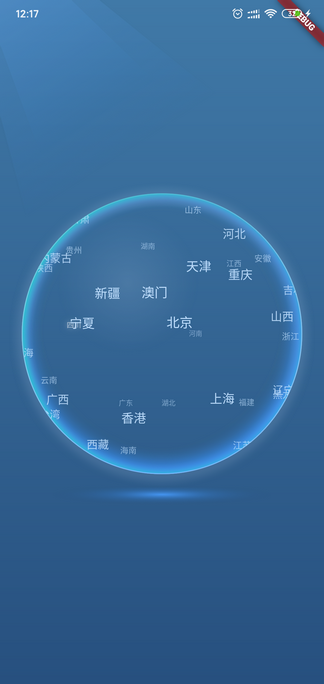
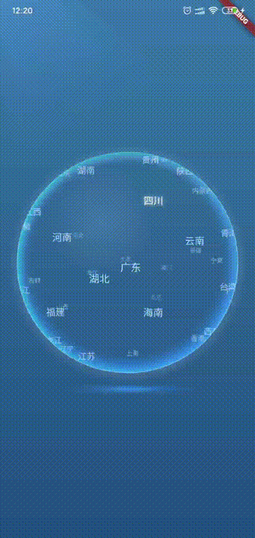

# 简介

这是之前项目中用到的一个3D球控件，实现了文字元素在球面上的分布以及球体滚动时文字外形和运动轨迹的透视效果。

因为没有实现丰富的可定制性和通用性，因此这里仅提供源码，并对一些实现要点做简要介绍。若需实现类似效果可以参考。

 

# 主要思路

- 建立了一个虚拟的3d坐标系：坐标原点位于球心，Z轴垂直于屏幕并指向屏幕外。根据球面方程将需要绘制的点均匀散布到整个球面上。
- 由点坐标可以得到点在XY平面上的投影位置；根据点到球体最前方垂直切面的距离，计算点的尺寸和颜色值（距离越远，尺寸越小，颜色越暗淡）。
- 由球体旋转的方向和位移可以得到球体的旋转轴矢量和旋转角，进而可由[罗德里格旋转公式](https://baike.baidu.com/item/%E7%BD%97%E5%BE%B7%E9%87%8C%E6%A0%BC%E6%97%8B%E8%BD%AC%E5%85%AC%E5%BC%8F)计算出旋转后点的坐标。

# 部分代码说明

## 点

Point类中主要存储了点的坐标(x,y,z)和要显示的文字(name)。

另外，考虑到球体处于持续动画的状态，如果在渲染每帧动画时去实时地计算渲染文字的Paragraph对象，那么对系统机能是一个很大的负担，可能会造成画面卡顿。因此，这里采取的做法是，在控件初始化时，预先计算好点在不同Z坐标时的Paragraph对象并缓存起来(paragraphs)，后面渲染动画时直接通过`getParagraph(int radius)`方法去缓存中取。同时为了节约内存，每三个相邻的Z坐标只生成一个Paragraph对象。

```dart
class Point {
  double x, y, z;
  String name;
  List<ui.Paragraph> paragraphs;

  Point(this.x, this.y, this.z);

  //z取值[-radius,radius]时的paragraph，依次存储在paragraphs中
  //每3个z生成一个paragraphs
  getParagraph(int radius) {
    int index = (z + radius).round() ~/ 3;
    return paragraphs[index];
  }
}
```

## 旋转计算

**计算旋转轴方向的单位矢量**

因为是以球心为坐标原点且XY平面平行于屏幕，因此计算旋转轴矢量很简单，就是将旋转方向矢量(x,y)逆时针旋转90度，z取零即可：

```dart
///由旋转矢量得到旋转轴方向的单位矢量
///将旋转矢量(x,y)逆时针旋转90度即可
///x2 = xcos(pi/2)-ysin(pi/2)
///y2 = xsin(pi/2)+ycos(pi/2)
Point getAxisVector(Offset scrollVector) {
  double x = -scrollVector.dy;
  double y = scrollVector.dx;
  double module = sqrt(x * x + y * y);
  return Point(x / module, y / module, 0);
}
```

**根据球体的旋转轴和旋转弧度角计算点的新坐标**

原理——罗德里格旋转矢量公式。设旋转轴的单位矢量为r，旋转角度为θ。三维点（或者说三维矢量）p绕旋转轴正向旋转角度θ得到p′，则：


对应的dart代码就是：

```dart
///计算点point绕轴axis旋转radian弧度后的点坐标
///计算依据：罗德里格旋转矢量公式
void rotatePoint(
  Point axis,
  Point point,
  double radian,
) {
  double x = cos(radian) * point.x +
      (1 - cos(radian)) *
          (axis.x * point.x + axis.y * point.y + axis.z * point.z) *
          axis.x +
      sin(radian) * (axis.y * point.z - axis.z * point.y);

  double y = cos(radian) * point.y +
      (1 - cos(radian)) *
          (axis.x * point.x + axis.y * point.y + axis.z * point.z) *
          axis.y +
      sin(radian) * (axis.z * point.x - axis.x * point.z);

  double z = cos(radian) * point.z +
      (1 - cos(radian)) *
          (axis.x * point.x + axis.y * point.y + axis.z * point.z) *
          axis.z +
      sin(radian) * (axis.x * point.y - axis.y * point.x);

  point.x = x;
  point.y = y;
  point.z = z;
}
```

## 手势

因为球体的手势交互较多，除了点击之外，还需实现触摸停止、释放继续、触摸滚动、惯性滚动等，为了方便，直接采取了监听原始指针事件的方式。

- 点击：若手指按下坐标和抬起坐标之间的距离小于4，则认为是点击事件。对比手指坐标和数据点在XY平面上的投影坐标，确认是否有数据点被命中。
- 惯性滚动：手指移动时将手指位置和时间记录在速度跟踪队列中，手指抬起时据此计算手指移动速度，如果大于临界值则认为是fling手势。

```dart
Listener(
    onPointerDown: (PointerDownEvent event) {
        int now = DateTime.now().millisecondsSinceEpoch;
        downPosition = convertCoordinate(event.localPosition);
        lastPosition = convertCoordinate(event.localPosition);

        //速度跟踪队列
        clearQueue();
        addToQueue(PositionWithTime(downPosition, now));

        //手指触摸时停止动画
        controller.stop();
    },
    onPointerMove: (PointerMoveEvent event) {
        int now = DateTime.now().millisecondsSinceEpoch;
        Offset currentPostion = convertCoordinate(event.localPosition);

        addToQueue(PositionWithTime(currentPostion, now));

        Offset delta = Offset(currentPostion.dx - lastPosition.dx,
                              currentPostion.dy - lastPosition.dy);
        double distance = sqrt(delta.dx * delta.dx + delta.dy * delta.dy);
        //若计算量级太小，框架内部会报精度溢出的错误
        if (distance > 2) {
            //旋转点
            setState(() {
                lastPosition = currentPostion;

                //球体应该旋转的弧度角度 = 距离/radius
                double radian = distance / radius;
                //旋转轴
                axisVector = getAxisVector(delta);
                //更新点的位置
                for (int i = 0; i < points.length; i++) {
                    rotatePoint(axisVector, points[i], radian);
                }
            });
        }
    },
    onPointerUp: (PointerUpEvent event) {
        int now = DateTime.now().millisecondsSinceEpoch;
        Offset upPosition = convertCoordinate(event.localPosition);

        addToQueue(PositionWithTime(upPosition, now));

        //检测是否是fling手势
        Offset velocity = getVelocity();
        //速度模量>=1就认为是fling手势
        if (sqrt(velocity.dx * velocity.dx + velocity.dy * velocity.dy) >= 1) {
            //开始fling动画
            currentRadian = 0;
            controller.fling();
        } else {
            //开始匀速动画
            currentRadian = 0;
            controller.forward(from: 0.0);
        }

        //检测点击事件
        double distanceSinceDown = sqrt(
            pow(upPosition.dx - downPosition.dx, 2) +
            pow(upPosition.dy - downPosition.dy, 2));
        //按下和抬起点的距离小于4，认为是点击事件
        if (distanceSinceDown < 4) {
            //寻找命中的point
            int searchRadiusW = 30;
            int searchRadiusH = 10;
            for (int i = 0; i < points.length; i++) {
                //points[i].z >= 0：只在球正面的点中寻找
                if (points[i].z >= 0 &&
                    (upPosition.dx - points[i].x).abs() < searchRadiusW &&
                    (upPosition.dy - points[i].y).abs() < searchRadiusH) {
                    int now = DateTime.now().millisecondsSinceEpoch;
                    //防止双击
                    if (now - lastHitTime > 2000) {
                        lastHitTime = now;

                        //创建点选中动画序列
                        pointAnimationSequence = PointAnimationSequence(
                            points[i], _needHight(points[i].name));

                        //跳转页面
                        Future.delayed(Duration(milliseconds: 500), () {
                            print("点击“${points[i].name}”");
                        });
                    }
                    break;
                }
            }
        }
    },
    onPointerCancel: (_) {
        //开始匀速动画
        currentRadian = 0;
        controller.forward(from: 0.0);
    },
    ...
);
```

# 源码及Demo

https://github.com/al4fun/3DBall